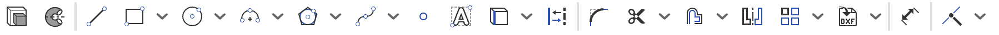
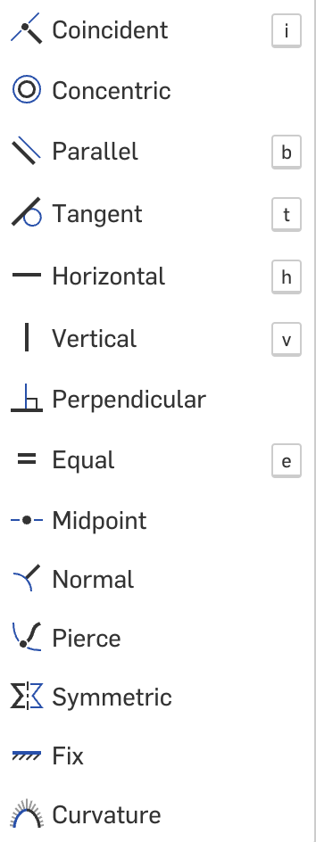

## OnShape Basics  

### Sketches 

Sketches are the base of all parts and creations on OnShape. They are 2D drawings that can be extruded, revolved, or lofted to create 3D parts. Sketches are made up of lines, circles, rectangles, and other shapes. Sketches are used to get a base design going for your project.

Here is a key going from far left to far right on the sketch toolbar.

- Extrude - Extrudes the sketch to make it 3D
- Revolve - Revolves the sketch around an axis to make it 3D
- Line - Used to create a line in your sketch
- Rectangle - Used to create a rectangle in your sketch
- Circle - Used to create a circle in your sketch
- Arc - Used to create an arc in your sketch, you might have to play around with this more to learn how you want to use it
- Polygon - Used to create a polygon in your sketch, you can change the number of sides in the polygon, radius and side length
- Spline - Used to create a spline in your sketch, this is usually used to create a smooth curve
- Point - Used to create a point in your sketch, this can be used to find the center of a rectangle and much more
- Text - Used to create text in your sketch, you can change the font, size, and style of the text
- Construction - This is used to create construction lines in your project. These are used to create lines you don't want to actually use in your sketch and 3D model. These can be used to find centers of shapes and much more
- Fillet - This is used to create a smooth edge out of a 90º angle
- Trim - This is used to trim lines in your sketch, you can use this to trim lines that are overlapping or lines that are too long
- Offset - This is used to create a line that is a certain distance away from another line. You can use this to create walls in a project
- Mirror - This is used to mirror a line or shape in your sketch. You can use this to create symmetrical shapes
- Patterns - This is used to create a pattern of a line or shape in your sketch. You can use this to create a pattern of holes or other shapes
    - Linear Pattern - This is used to create a linear pattern of a line or shape in your sketch. You can use this to create a pattern of holes or other shapes in one single axis
    - Circular Pattern - This is used to create a circular pattern of a line or shape in your sketch. You can use this to create a pattern of holes or other shapes in a circular pattern
- Insert Image or DWG - This can be used to import an image if you need to replicate something
- Distance - This is used to measure the distance between two points in your sketch, this can also be used to measure radius and diameter of circles
- Constraints - This will be explained next

### Constraints 

Constraints are the way you make sure any changes to your sketch don't mess up the rest of the design. Constraints are often used as a way to make sure a line is long enough or a circle has the correct radius. You can also use them to make sure two lines are parallel or perpendicular. Constraints are a very important part of OnShape and need to be used in almost every sketch.

Here is a key going from top to bottom on the constraint toolbar.

- Coincident - This is used to make sure two lines or points are touching each other
- Concentric - This is used to make sure two points are on the same point
- Parallel - This is used to make sure two lines are parallel to each other
- Tangent - This is used to make sure a line is tangent to a circle or arc
- Horizontal - This is used to make sure a line is horizontal
- Vertical - This is used to make sure a line is vertical
- Perpendicular - This is used to make sure two lines are perpendicular to each other
- Equal - This is used to make sure two lines are equal to each other, this can be used to make sure the lengths are equal or the radius of two circles are equal
- Midpoint - This is used to make sure a point is in the middle of a line
- Normal - This is used to make sure a line is normal to a plane
- Pierce - This is used to make sure a line is piercing a circle or arc
- Symmetric - This is used to make sure a line is symmetric to another line
- Fix - This is used to make sure a line is fixed in place, this is used to make sure a line doesn't move when you change the sketch
- Curvature - This is used to create constant curvature between two lines

### Parts 

A part is almost like a finished creation. You can create multiple parts in order to export them as STL files for 3D printing. Parts are made up of sketches that have been extruded, revolved, or lofted. Parts are the final step in creating a 3D model and putting it all together.

This video will show you more about sketching, constraints, and parts.

[Click here][gDrive] and open the sketches video.

[repo]: https://github.com/GramGra07/3D-Training-Module/blob/main/README.md
[page]: https://gramgra07.github.io/3D-Training-Module/
[3D]: https://docs.google.com/presentation/d/1MeLkA9mCI4vZMiejlqMZpAhZvbV2ThvSf6oZBzhQGdo/edit#slide=id.g1f87997393_0_782
[follow]: followAlong.md
[relations]: advancedOnshape.md#relation
[mates]: advancedOnshape.md#mate
[assemble]: advancedOnshape.md#assemble
[adv]: advancedOnshape.md
[part]: basics.md#part
[constrain]:basics.md#constrain
[sketch]: basics.md#sketch
[basic]: basics.md
[gDrive]: https://drive.google.com/drive/folders/1Uytvd03vpVqoOG7LKv7-ee3CknBhoNIM?usp=sharing